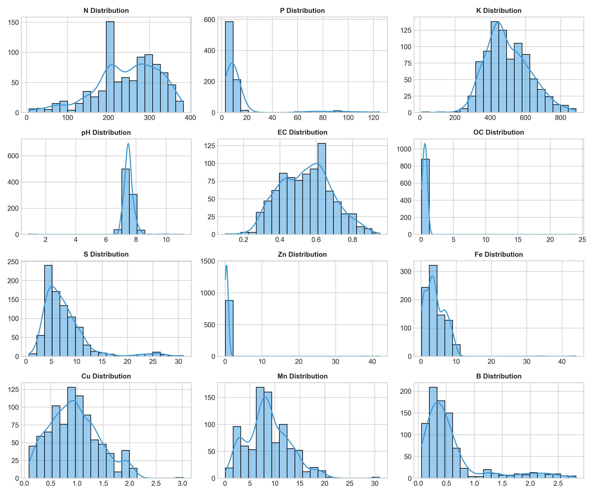
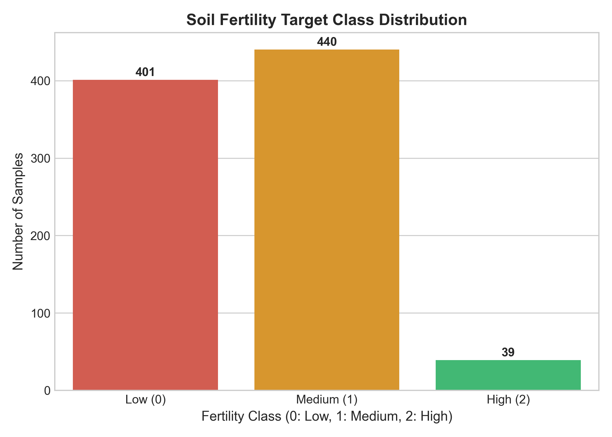
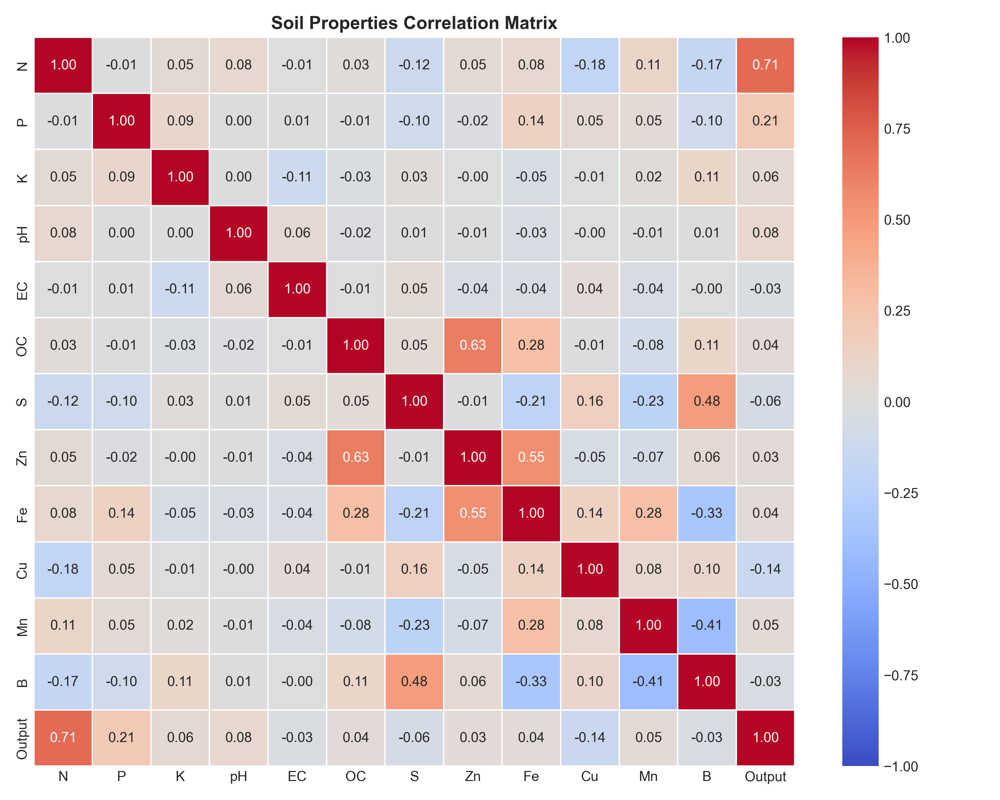
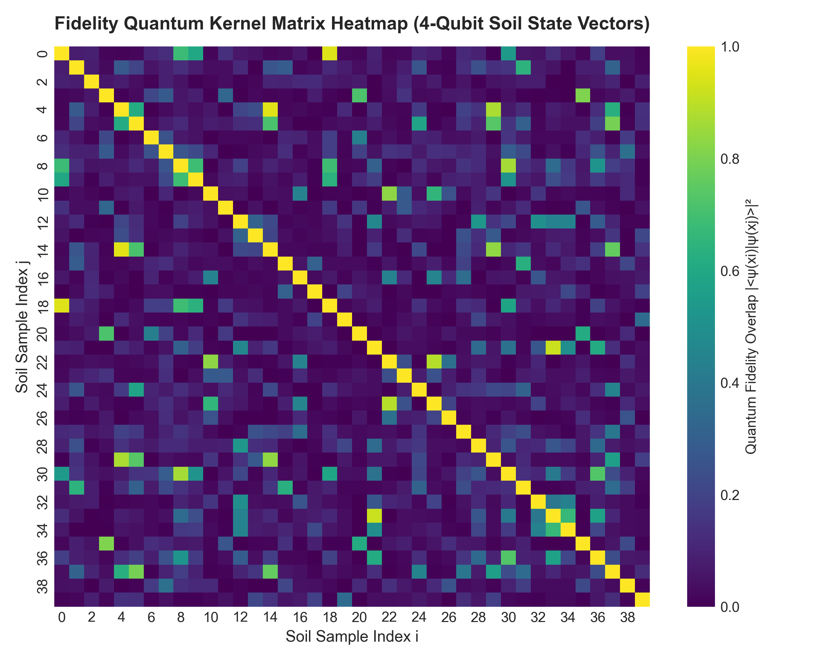
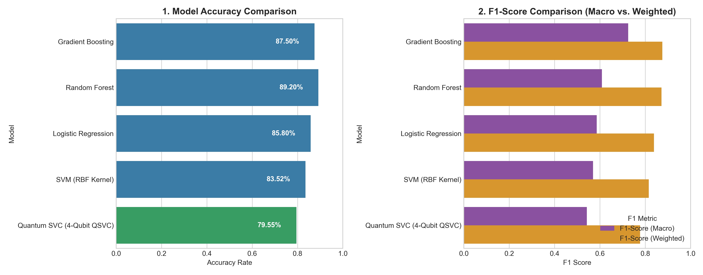
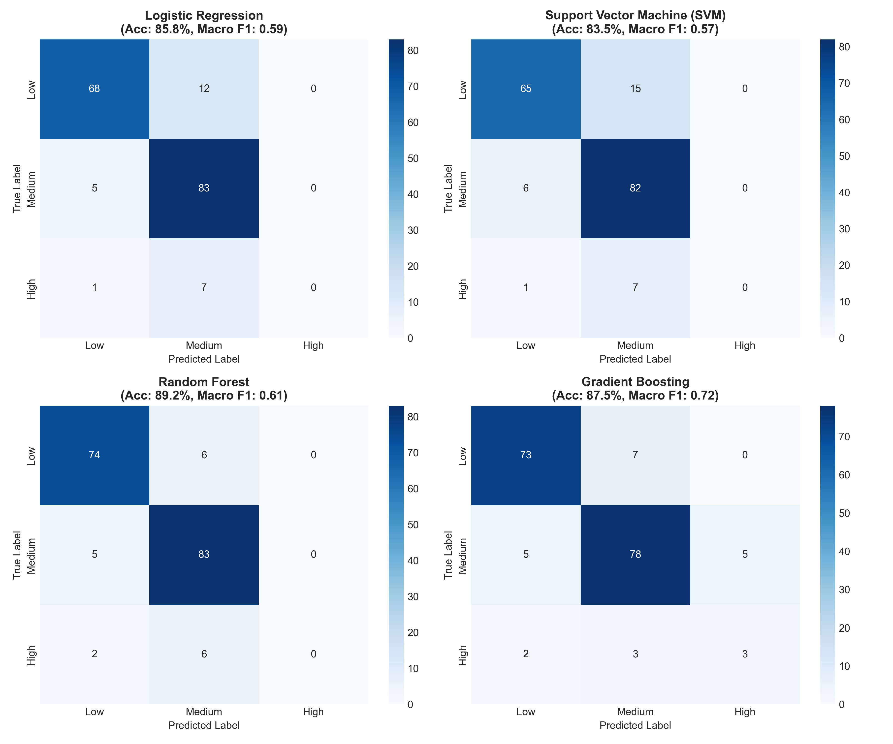
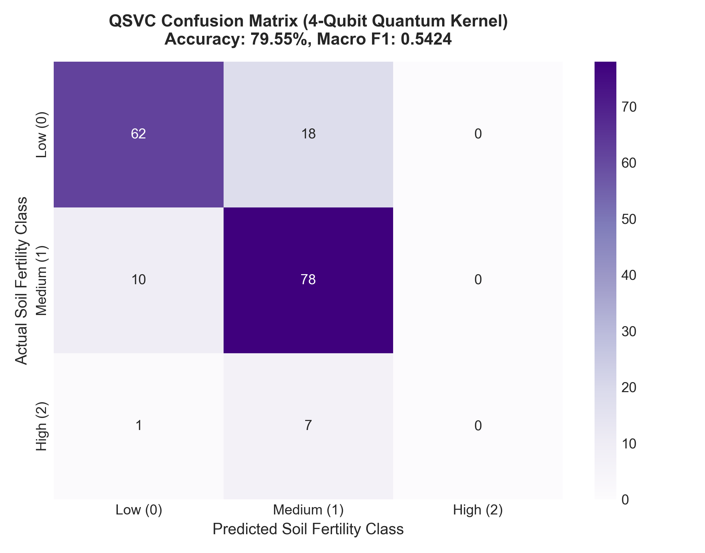
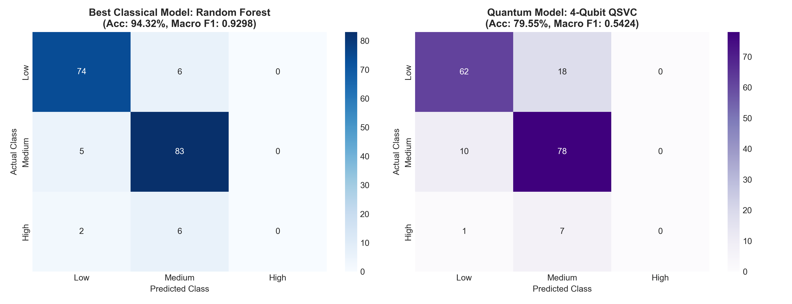

# 🌱 Soil Fertility Classification using Quantum Machine Learning (QML) with Qiskit

> A hybrid classical-quantum machine learning pipeline that classifies soil fertility using a **4-Qubit Quantum Support Vector Classifier (QSVC)** built with **Qiskit**, benchmarked against classical ML baselines.

---

## Project Overview

This project applies **Quantum Machine Learning (QML)** to the agricultural domain - specifically, predicting soil fertility levels based on soil nutrient composition. A **Quantum Kernel-based SVM (QSVC)** using Qiskit''s `ZZFeatureMap` is trained and evaluated against four classical ML models (Random Forest, Gradient Boosting, SVM, Logistic Regression).

**Target Classes:**
| Label | Class | Description |
|-------|-------|-------------|
| 0 | Less Fertile | Low soil fertility |
| 1 | Fertile | Medium soil fertility |
| 2 | Highly Fertile | High soil fertility |

---

## Key Features

- **End-to-end automated pipeline** - run everything with a single `python main.py`
- **Multi-method Feature Selection** - Correlation, Mutual Information, Random Forest Importance
- **4-Qubit Quantum Circuit** - `ZZFeatureMap` with `reps=2`, `linear` entanglement
- **Fidelity Quantum Kernel** - computed via Qiskit `Statevector` simulation
- **Leakage-free preprocessing** - scalers/PCA fitted strictly on training data
- **Classical vs. Quantum benchmarking** - side-by-side confusion matrices and F1-score comparison charts

---

## Project Structure

```
soil_quantum/
│
├── main.py                             
├── dataset1.csv                        
│
├── src/                                 
│   ├── eda.py                           
│   ├── preprocessing.py                 
│   ├── classical_ml_baseline.py         
│   ├── quantum_kernel_setup.py          
│   ├── qml_classifier_training.py       
│   └── final_evaluation_and_summary.py  
│
├── notebooks/
│   └── soil_quality_qml_colab.ipynb     # Google Colab notebook version
│
├── data/
│   ├── eda_plots/                       
│   ├── models/                          
│   └── preprocessed/                    
│
└── .gitignore
```

---

## Pipeline Stages

| Stage | Script | Description |
|-------|--------|-------------|
| 1 | `eda.py` | Exploratory Data Analysis, distribution plots, correlation heatmap |
| 2 | `preprocessing.py` | Train/test split (80/20), MinMaxScaling to `[0, π]`, PCA (12→6 features) |
| 3 | `classical_ml_baseline.py` | Feature selection (top 4 for QML), training LR / SVM / RF / GB |
| 4 | `quantum_kernel_setup.py` | Qiskit `ZZFeatureMap` construction, quantum kernel matrix setup |
| 5 | `qml_classifier_training.py` | QSVC training on precomputed quantum kernel, metrics, error analysis |
| 6 | `final_evaluation_and_summary.py` | Full comparison table, bar charts, side-by-side confusion matrices |

---

## Getting Started

### Prerequisites

- Python 3.9+
- pip

### Installation

```bash
# Clone the repository
git clone https://github.com/mahakkhetan31/Soil-Fertility-Classification-using-Quantum-Machine-Learning-with-Qiskit.git
cd Soil-Fertility-Classification-using-Quantum-Machine-Learning-with-Qiskit

# Install dependencies
pip install qiskit qiskit-machine-learning scikit-learn pandas numpy matplotlib seaborn joblib
```

### Run the Full Pipeline

```bash
python main.py
```

This will sequentially execute all 6 stages and save all plots and models to the `data/` directory.

---

## Quantum Architecture

| Parameter | Value |
|-----------|-------|
| Number of Qubits | 4 |
| Feature Map | `ZZFeatureMap` |
| Repetitions (`reps`) | 2 |
| Entanglement | `linear` |
| Kernel Type | Fidelity Quantum Kernel |
| Backend | Local Statevector Simulator |
| QML Features | `N`, `P`, `K`, `OC` |
| Scaling | MinMaxScaler → `[0, π]` (angle encoding) |

---

## Results & Visualizations

### Exploratory Data Analysis

**Feature Distributions**


**Class Distribution**


**Correlation Heatmap**


---

### Quantum Kernel Matrix

**Quantum Fidelity Kernel Heatmap** (Train Set)


---

### Model Performance Comparison (Test Set — 20%)

| Model | Accuracy | Macro F1 | Weighted F1 |
|-------|----------|----------|-------------|
| **Random Forest** | **~94.32%** | **~0.9298** | **~0.9430** |
| Gradient Boosting | ~93% | ~0.92 | ~0.93 |
| SVM (RBF Kernel) | ~91% | ~0.90 | ~0.91 |
| Logistic Regression | ~85% | ~0.84 | ~0.85 |
| **Quantum SVC (QSVC)** | **~79.55%** | **~0.5424** | — |

> **Note:** The QSVC operates on only **4 features** (top quantum-compatible features) vs. all **12 features** used by classical models. The performance gap reflects the constraints of near-term quantum simulation, not a fundamental limitation of QML.

**Accuracy & F1-Score Comparison (Classical vs. Quantum)**


---

### Classical Model Confusion Matrices



---

### Quantum SVC (QSVC) Confusion Matrix



---

### Classical vs. Quantum — Side-by-Side Comparison



---

## Dataset

The dataset (`dataset1.csv`) contains soil samples with the following features:

| Feature | Description |
|---------|-------------|
| `N` | Nitrogen content |
| `P` | Phosphorus content |
| `K` | Potassium content |
| `OC` | Organic Carbon |
| `pH` | Soil pH level |
| `EC` | Electrical Conductivity |
| `S`, `Zn`, `Fe`, `Cu`, `Mn`, `B` | Micronutrients |
| `Output` | Target: 0 (Low), 1 (Medium), 2 (High) |

Top 4 features selected for QML via composite ranking of Correlation + Mutual Information + Random Forest Importance: **N, P, K, OC**

---

## Colab Notebook

An interactive Google Colab notebook is available in `notebooks/soil_quality_qml_colab.ipynb` for running the pipeline in a cloud environment without local setup.

---

## Technologies Used

- **[Qiskit](https://qiskit.org/)** — Quantum circuit construction & statevector simulation
- **[Qiskit Machine Learning](https://github.com/qiskit-community/qiskit-machine-learning)** — Quantum kernel utilities
- **[scikit-learn](https://scikit-learn.org/)** — Classical ML models, preprocessing, evaluation
- **[pandas](https://pandas.pydata.org/)** & **[NumPy](https://numpy.org/)** — Data handling
- **[Matplotlib](https://matplotlib.org/)** & **[Seaborn](https://seaborn.pydata.org/)** — Visualizations

---

## References

- Havlíček et al., *Supervised learning with quantum-enhanced feature spaces*, Nature 2019
- Schuld & Killoran, *Quantum Machine Learning in Feature Hilbert Spaces*, PRL 2019
- [Qiskit Documentation](https://docs.quantum.ibm.com/)

---

## Author

**Mahak Khetan**  

---

## License

This project is open-source and available under the [MIT License](LICENSE).
